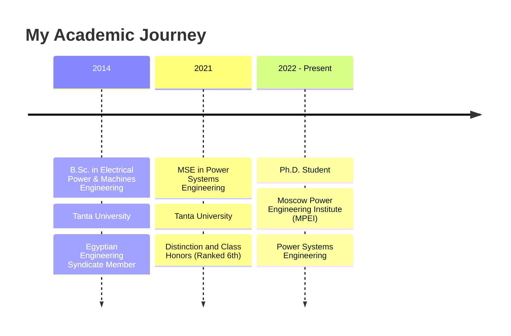

this is my site i host it at github pages,

i have buld it based on the jekell theme "minimal-mistakes"

but i did not do all the things needed to make it a good site
this include google adds, analytics, sitemap, robots.txt, etc
and also this site is not indexed by google that means it is not discoverable by people searching for it

i will give you the links of my profile to use it to enhance the site

i am uses this site to write an article in arabic language make it also freindly to arabic language as it and enhance it

"this is readme file in github i want to use the infromation in it

"# <div align="center">

  
</div>

> PhD, MSE in Power Systems Engineering | Researcher & Author | Expert in FACTS, Industrial Protection & Decarbonization | Software Developer (MATLAB, Python, C, R, STM32)

Welcome to my GitHub profile! I'm an **Assistant Lecturer** in the **Electrical Power and Machines Engineering Department** at the Faculty of Engineering, Tanta University, and a **PhD student** at the prestigious **Moscow Power Engineering Institute** (MPEI). With an **MSE in Power Systems Engineering**, I specialize in **FACTS devices**, **Industrial Protection systems**, and **Decarbonization technologies**.

<div align="center">
  
  
</div>

## 📚 Research & Expertise

My research focuses on **FACTS (Flexible AC Transmission Systems) devices**, **Industrial Protection systems**, and **Decarbonization technologies** for power systems. I have extensive expertise in **power system analysis**, **unbalanced loading impacts**, and **arc suppression devices** for fault protection. With strong programming skills in **MATLAB**, **Python**, **C**, **R**, and **STM32 microcontrollers**, I develop innovative solutions for modern power system challenges.

<details>
  <summary><b>🔬 Research Focus Areas</b></summary>
  <br>
  <ul>
    <li>FACTS Devices (Flexible AC Transmission Systems)</li>
    <li>Industrial Protection Systems</li>
    <li>Arc Suppression Devices for Fault Protection</li>
    <li>Unbalanced Loading Impact Analysis</li>
    <li>Distribution Network Reliability</li>
    <li>Wind Energy Integration</li>
    <li>Decarbonization Technologies</li>
    <li>Power Quality Enhancement</li>
    <li>Islanding Detection in Distribution Networks</li>
  </ul>
</details>

## 📝 Latest Publications

<details open>
  <summary><b>Selected Research Papers</b></summary>
  <br>
  <ul>
  </ul>
  <a href="https://scholar.google.com/citations?user=KbZs8_AAAAAJ&hl=en">View all publications on Google Scholar →</a>
</details>

my articles

@thesis{Ahmed2019b,
title = {Islanding {{Scenarios}} for {{High Reliable Operation}} of {{Distribution Networks}}},
author = {Elkholy, Ahmed M. and El-Ghany, Hossam A.Abd Abd and Azmy, Ahmed M.},
date = {2019-05-01},
institution = {Tanta University},
location = {Tanta University},
doi = {doi.org/10.5281/zenodo.5816968},
abstract = {This study introduces a new methodology for performing intentional islanding with maximum possible benefits for distribution systems. The methodology is based on an advanced load shedding algorithm to achieve load generation balance and apply a control strategy to ensure a smooth transition from normal mode to island mode with high load power quality. Generally, the load shedding algorithm is applied to improve the reliability by serving maximum number of customers. Investigation of the dynamic behavior of the distribution network during transition due to intentional islanding is a main concern in this thesis. When operating in the island mode, the local supervisory control system can modify the generator frequency controller and voltage controller to guarantee high power quality for the new isolated system. In addition, it is suggested to assess the small signal stability of new islands to evaluate their performance and give priority among different alternatives. Small signal stability study is introduced for each island to check the stability for the new islands. IEEE 33-bus system is taken as a case study to ensure the effectiveness of the introduced methodology. The analysis is performed for a case study with optimal DG locations and sizes. NEPLAN software is used for dynamics and small signal stability investigations.},
keywords = {distribution generation,intentional islanding,load shedding,power system reliability,Power system stability,Small signal stability,smart micro-grid},
file = {D:\Zotero\storage\8J86M7D8\Islanding Scenarios for High Reliable Operation of Distribution NetworksElkholy et al*2019*.pdf}
}

@software{AhmedElkholy2025,
title = {Ahmelkholy/{{Sensitivity}}\_{{Analysis}}\_{{EV}}: 0.1},
shorttitle = {Ahmelkholy/{{Sensitivity}}\_{{Analysis}}\_{{EV}}},
author = {Ahmed Elkholy},
date = {2025-04-03},
doi = {10.5281/ZENODO.15130215},
abstract = {this is the final of sensitivity analysis and it will be updated when the final version of the paper will be published},
organization = {Zenodo},
version = {0.1},
keywords = {/unread}
}

@article{AhmedM.Elkholy2023,
title = {The {{Influence}} of {{Transmission-Line Parameters}} and {{Its Load}} on {{Losses}} and {{Power Quality}} at the {{Load-Connection Point}}},
author = {{Ahmed M. Elkholy} and Panfilov, D. I. and Astashev, M. G.},
date = {2023-06},
journaltitle = {Russian Electrical Engineering},
shortjournal = {Russ. Electr. Engin.},
volume = {94},
number = {6},
pages = {403--411},
issn = {1068-3712, 1934-8010},
doi = {10.3103/S1068371223060044},
langid = {english},
keywords = {/unread,1.Reviewed,2.Need Review,5.Thesis},
annotation = {3 citations (Crossref) [2024-04-29]},
file = {D:\Zotero\storage\E4GPQ9TU\Ahmed M. Elkholy et al. - 2023 - The Influence of Transmission-Line Parameters and Its Load on Losses and Power Quality at the Load-C.pdf}
}

@article{Elkholi2024,
title = {Analysis of the {{Influence}} of {{Symmetrical Devices}} on the {{Operating Modes}} of {{Distribution Networks}}},
author = {Elkholi, A. M. and Panfilov, D. I. and Astashev, M. G. and Chasov, A. V. and Panfilov, I. D. and Ostrirov, V. N.},
date = {2024-06},
journaltitle = {Russian Electrical Engineering},
shortjournal = {Russ. Electr. Engin.},
volume = {95},
number = {6},
pages = {425--440},
issn = {1068-3712, 1934-8010},
doi = {10.3103/S1068371224700470},
langid = {english},
keywords = {5.Thesis},
file = {D:\Zotero\storage\BL64F8FB\Elkholi et al. - 2024 - Analysis of the Influence of Symmetrical Devices on the Operating Modes of Distribution Networks.pdf}
}

@inproceedings{Elkholy_tassul_EDM24,
title = {Comprehensive {{Study}} of the {{Impact}} of {{Unbalanced Loading}} on {{Power Losses andVoltage Quality}} in {{Distribution Systems}}},
booktitle = {2024 {{IEEE}} 25th {{International Conference}} of {{Young Professionals}} in {{Electron Devices}} and {{Materials}} ({{EDM}})},
author = {Elkholy, Ahmed M. and Panfilov, Dmitry I. and Astashev, Mikhail G. and Chasov, Andrew V.},
date = {2024-06-28},
pages = {1340--1346},
publisher = {IEEE},
location = {Altai, Russian Federation},
doi = {10.1109/EDM61683.2024.10615221},
eventtitle = {2024 {{IEEE}} 25th {{International Conference}} of {{Young Professionals}} in {{Electron Devices}} and {{Materials}} ({{EDM}})},
isbn = {979-8-3503-8923-4},
keywords = {5.Thesis},
file = {D:\Zotero\storage\LE36VHTI\Elkholy et al. - 2024 - Comprehensive Study of the Impact of Unbalanced Lo.pdf}
}

@inproceedings{Elkholy2017,
title = {A Proposed Load Shedding Mechanism for Enhancing Intentional-Islanding Dynamics of Distribution Systems},
booktitle = {2017 {{Nineteenth International Middle East Power Systems Conference}} ({{MEPCON}})},
author = {Elkholy, Ahmed M. and El-Ghany, Hossam A. Abd and Azmy, Ahmed M.},
date = {2017-12},
pages = {870--875},
publisher = {IEEE},
location = {Cairo},
doi = {10.1109/MEPCON.2017.8301282},
eventtitle = {2017 {{Nineteenth International Middle East Power Systems Conference}} ({{MEPCON}})},
isbn = {978-1-5386-0990-3},
keywords = {Distribution generation (DG),Dynamic behavior,Intentional islanding operation,Islanding detection,Load shedding},
annotation = {5 citations (Crossref) [2024-04-29]},
file = {D:\Zotero\storage\UZZ6QDH5\A proposed load shedding mechanism for enhancing intentional-islanding dynamicsElkholy et al*2017*.pdf}
}

@inproceedings{Elkholy2018,
title = {An {{Advanced Load Shedding Algorithm}} to {{Enhance Intentional-Islanding Dynamics}}},
booktitle = {2018 {{Twentieth International Middle East Power Systems Conference}} ({{MEPCON}})},
author = {Elkholy, Ahmed M. and El-Ghany, Hossam A. Abd and Azmy, Ahmed M.},
date = {2018-12},
pages = {797--802},
publisher = {IEEE},
location = {Cairo, Egypt},
doi = {10.1109/MEPCON.2018.8635139},
eventtitle = {2018 {{Twentieth International Middle East Power Systems Conference}} ({{MEPCON}})},
isbn = {978-1-5386-6652-4 978-1-5386-6654-8},
keywords = {/unread,Distribution generation (DG),Dynamic behavior,Intentional islanding operation,Islanding detection,Load shedding},
annotation = {4 citations (Crossref) [2024-04-29]},
file = {D:\Zotero\storage\C2W7LL93\An Advanced Load Shedding Algorithm to Enhance Intentional-Islanding DynamicsElkholy et al*2018*.pdf}
}

@article{Elkholy2020,
title = {General {{Framework}} for {{Intentional Islanding}} to {{Enhance Distribution System Performance}}},
author = {Elkholy, Ahmed M. and Abd el-Ghany, Hossam A. and Azmy, Ahmed M.},
date = {2020-09-13},
journaltitle = {Electric Power Components and Systems},
shortjournal = {Electric Power Components and Systems},
volume = {48},
number = {14--15},
pages = {1488--1507},
issn = {1532-5008, 1532-5016},
doi = {10.1080/15325008.2020.1856227},
abstract = {Due to the increase of load demand, the utility tends to utilize DG technology in recent years. The intentional islanding is an appropriate approach to enhance system performance such as reliability and operational flexibility. This research provides a new paradigm for intentional islanding to maximize the efficiency of the power system. The methodology is based on an advanced load shedding algorithm to achieve a load generation balance and control strategy to ensure a smooth transition from normal mode to island mode with high load power quality. Moreover, it is suggested to assess the small-signal stability of new islands to evaluate their performance and give priority among different alternatives. IEEE 33-bus system is taken as a case study to ensure the effectiveness of the introduced methodology. The analysis is performed for a case study with optimal DG locations and sizes. NEPLAN software is used for dynamics and smallsignal stability investigations.},
langid = {english},
keywords = {/unread,distribution generation,intentional islanding,load shedding,power system reliability,power system stability,small signal stability,smart micro-grid},
file = {D\:\\Zotero\\storage\\338694BI\\Elkholy et al. - 2020 - General Framework for Intentional Islanding to Enhance Distribution System Performance.pdf;D\:\\Zotero\\storage\\RV38T38Y\\General Framework for Intentional Islanding to Enhance Distribution SystemElkholy et al*2020*.pdf}
}

@article{Elkholy2022,
title = {Grid {{Synchronization Enhancement}} of {{Distributed Generators Using}} an {{Adaptive Phase-Locked Loop Tuning System}}},
author = {Elkholy, Ahmed M. and Taha, Ibrahim B. M. and Kamel, Salah and El-Nemr, Mohamed K.},
date = {2022-02-24},
journaltitle = {Electronics},
shortjournal = {Electronics},
volume = {11},
number = {5},
pages = {702},
issn = {2079-9292},
doi = {10.3390/electronics11050702},
abstract = {This paper proposes an effective algorithm; this algorithm is updating the phase-locked loop (PLL) gains according to the value of the short circuit ratio that will decrease the weak grid effect in the PLL controllers to reduce problems related to renewable energy sources and connect to the point of common coupling (PCC). Based on system parameters estimation, the proposed algorithm enhances the system stability for the distribution networks. The standard IEEE 33-bus test system is used to investigate the proposed algorithm's effectiveness and superiority. An extensive mathematical effort is exerted to get the system's small-signal stability (SSS) model. The tuning of the phase-locked loop and the current control loop are choosing to dynamically change according to the system variables to ensure the same system stability margin, whatever the change in the loading conditions. The MATLAB/Simulink model is used to validate the algorithm and simulate the test system.},
langid = {english},
annotation = {5 citations (Crossref) [2024-04-29]},
file = {D:\Zotero\storage\K99BA5J4\Grid Synchronization Enhancement of Distributed Generators Using an AdaptiveElkholy et al*2022*.pdf}
}

@article{Elkholy2025,
title = {Comparative Analysis of {{FACT}} Devices for Optimal Improvement of Power Quality in Unbalanced Distribution Systems},
author = {Elkholy, Ahmed M. and Panfilov, Dmitry I. and ELGebaly, Ahmed E.},
date = {2025-01-21},
journaltitle = {Scientific Reports},
shortjournal = {Sci Rep},
volume = {15},
number = {1},
pages = {1--16},
publisher = {Nature Publishing Group},
issn = {2045-2322},
doi = {10.1038/s41598-024-57331-4},
abstract = {This study examines the performance of asymmetric three-phase distribution systems under the influence of FACT deives such as a static VAR compensator (SVC) and a unified power controller (UPC). Each suggested device's operating principle is developed in this paper in order to provide the best model to be used in the power flow analysis. The performance of the IEEE-13 bus imbalanced distribution model is investigated using the Newton-Raphson method. To improve network asymmetry, an optimization analysis is carried out to ascertain how each proposed device will work. In this paper, the mode of operation of each device is determined every hour to flow the changing in loads according to their daily load curve. The genetic algorithm (GA) is utilized to determine the contribution of the unified flow controller to balance the loads between phases. The multi-objective function is constructed to combine the total system losses and the average voltage unbalance coefficient. The paper provides an optimal dynamic technique to optimally operate the unified power flow controller installed in the unbalanced three-phase distribution system.},
issue = {1},
langid = {english},
keywords = {/unread,5.Thesis},
file = {D:\Zotero\storage\S37I694L\Elkholy - Comparative analysis of FACT devices for optimal improvement of power quality in unbalanced distribu.pdf}
}

@dataset{Elkholy2025a,
title = {{{ARC Dataset}}: {{Arc Suppression Device Analysis Results}}},
shorttitle = {{{ARC Dataset}}},
author = {Elkholy, Ahmed},
date = {2025-01-31},
publisher = {Zenodo},
doi = {10.5281/zenodo.14782003},
abstract = {\# ARC Dataset: Arc Suppression Device Analysis Results \#\# Description This dataset contains MATLAB simulation results supporting research on Arc Suppression Device (ASD) technology for mitigating single line-to-ground faults in power systems. The data encompasses four test scenarios analyzing fault current reduction, overvoltage mitigation, and voltage restoration improvements. \#\# Research Highlights - 97.8\% reduction in fault current (from 2000A to 45A)- Overvoltage reduction from 1.5 p.u. to 1.1 p.u.- 92.9\% improvement in voltage restoration time- Enhanced power system resilience during faults \#\# Dataset Contents The dataset includes simulation results from a four-bus system implementation, with varying time intervals and parameter configurations. Data supports both theoretical analysis and practical implementation of ASD technology. \#\# Usage These files can be loaded in MATLAB for analysis and visualization of the simulation results. The data corresponds to the case study and results sections of the associated research paper. \#\# Associated Paper This dataset supports the research paper "Arc Suppression Device Technology" which presents comprehensive analysis of ASD implementation for power systems. \#\# Citation If you use this dataset, please cite:[Add citation information] \#\# License [Specify license] \#\# Contact [Add contact information] \#\# Keywords - Simulation Data- MATLAB Analysis- Parameter Sweep},
keywords = {5.Thesis},
file = {D:\Zotero\storage\U2JLATZW\14782003.html}
}

@inproceedings{Hussien2021,
title = {Performance {{Enhancement}} of {{Wave Energy Converters Integrated}} with {{DC Grids Using Energy Storage Systems}}},
booktitle = {2021 22nd {{International Middle East Power Systems Conference}} ({{MEPCON}})},
author = {Hussien, Mohamed G. and Elkholy, Ahmed M. and Mansour, Diaa-Eldin A. and Akl, Mahmoud M. and Numair, Mohamed and Soliman, Ismail A.},
date = {2021-12-14},
pages = {77--83},
publisher = {IEEE},
location = {Assiut, Egypt},
doi = {10.1109/MEPCON50283.2021.9686294},
eventtitle = {2021 22nd {{International Middle East Power Systems Conference}} ({{MEPCON}})},
isbn = {978-1-6654-1998-7},
keywords = {Batteries,Dc micogrid,Egypt costs,Generators,Mathematical models,PM linear generator,Power generation,Renewable energy sources,Simulation,Supercapacitors,System performance,Wave Energy,Wave energy conversion,Wave power,WecSim},
annotation = {3 citations (Crossref) [2024-04-29]},
file = {D\:\\Zotero\\storage\\7X6WGNP9\\Performance Enhancement of Wave Energy Converters Integrated with DC GridsHussien et al*2021*.pdf;D\:\\Zotero\\storage\\NV6CIGAZ\\9686294.html}
}

@software{kh23_sp_software_op_ieee13,
title = {{{IEEE13-optimization}}: The Final Version},
shorttitle = {Engahmelkholy/{{IEEE13-optimization}}},
author = {Elkholy, Ahmed},
date = {2023-03-23},
doi = {10.5281/ZENODO.7763420},
abstract = {this is the final version before posting to zendo},
organization = {Zenodo},
version = {v1.0.0}
}

@inproceedings{kh23design,
title = {Design and {{Implementation}} of an {{Arc Suppression Device}} for {{Single Line}} to {{Ground Faults}} in {{Power Systems}}},
booktitle = {2023 24th {{International Middle East Power System Conference}} ({{MEPCON}})},
author = {Elkholy, Ahmed M. and Panfilov, Dmitry I. and Astashev, Mikhail G.},
date = {2023-12-19},
pages = {1--7},
publisher = {IEEE},
location = {Mansoura, Egypt},
doi = {10.1109/MEPCON58725.2023.10462330},
abstract = {This paper proposes an arc suppression device to address hazardous arcs caused by shunt faults in power systems. The device injects voltage into the neutral line path, reducing arc currents during fault conditions and preventing system isolation. Existing methods for arc suppression are reviewed, including passive and active technologies, with their limitations discussed. The paper presents design considerations for the proposed device, such as neutral path selection and voltage injection method, and evaluates its effectiveness through simulations conducted using MATLAB Simulink. The results show that the addition of a device that injects zero sequence component significantly limits the fault current in the faulty phase. The voltage at the load terminal is not affected by the addition of the device. The device is a low-cost and advantageous alternative to active arc suppression devices, combining the benefits of passive and active devices while avoiding their negative effects. Additionally, changing the open delta polarity or transformer ratio does not affect the fault current. Practical implementation issues, such as cost and compatibility with existing power system components, are also discussed.},
eventtitle = {2023 24th {{International Middle East Power System Conference}} ({{MEPCON}})},
isbn = {979-8-3503-5846-9},
langid = {english},
keywords = {/unread,5.Thesis},
file = {D:\Zotero\storage\7B77QMLH\Design and Implementation of an Arc Suppression Device for Single Line toElkholy et al*2023*.pdf}
}

@inproceedings{kh23edmUPCOPSIM,
title = {Evaluation of the {{Influence}} of {{AC Voltage Regulators}}, {{SVC}} and {{Unified Power Controllers}} on {{Power Losses}} and {{Quality}} in {{Unsymmetrical Distribution Systems}}},
booktitle = {2023 {{IEEE}} 24th {{International Conference}} of {{Young Professionals}} in {{Electron Devices}} and {{Materials}} ({{EDM}})},
author = {Panfilov, Dmitry I. and Elkholy, Ahmed M. and ELGebaly, Ahmed E.},
date = {2023-06-29},
pages = {950--956},
publisher = {IEEE},
location = {Novosibirsk, Russian Federation},
doi = {10.1109/EDM58354.2023.10225221},
eventtitle = {2023 {{IEEE}} 24th {{International Conference}} of {{Young Professionals}} in {{Electron Devices}} and {{Materials}} ({{EDM}})},
isbn = {979-8-3503-3687-0},
keywords = {5.Thesis},
annotation = {0 citations (Crossref) [2024-04-29]},
file = {D:\Zotero\storage\WZXYH9CD\Evaluation of the Influence of AC Voltage Regulators, SVC and Unified PowerPanfilov et al*2023*.pdf}
}

@inproceedings{kh23edmzigzag,
title = {Evaluation of {{Zero}} and {{Negative Sequence Currents Influence}} of {{Asymmetric Load}} on the {{Power Losses}} and {{Quality}} in {{Distribution Networks}}},
booktitle = {2023 {{IEEE}} 24th {{International Conference}} of {{Young Professionals}} in {{Electron Devices}} and {{Materials}} ({{EDM}})},
author = {Elkholy, Ahmed M. and Panfilov, Dmitry I. and El Gebaly, Ahmed E.},
date = {2023-06-29},
pages = {1110--1115},
publisher = {IEEE},
location = {Novosibirsk, Russian Federation},
doi = {10.1109/EDM58354.2023.10225208},
eventtitle = {2023 {{IEEE}} 24th {{International Conference}} of {{Young Professionals}} in {{Electron Devices}} and {{Materials}} ({{EDM}})},
isbn = {979-8-3503-3687-0},
keywords = {5.Thesis},
annotation = {2 citations (Crossref) [2024-04-29]},
file = {D:\Zotero\storage\DBU94VSN\Evaluation of Zero and Negative Sequence Currents Influence of Asymmetric LoadElkholy et al*2023*.pdf}
}

@dataset{kh24_wave_data,
title = {Wave {{Energy Power Dataset}} for {{Egyptian Shores}}},
author = {Elkholy, Ahmed M.},
date = {2024-05-29},
publisher = {Zenodo},
doi = {10.5281/ZENODO.11390985},
abstract = {This repository contains a dataset representing wave energy along the Egyptian shores. The data is intended for use with the [WEC-Sim](https://wec-sim.github.io/WEC-Sim/main/index.html) package, a wave energy converter simulation tool. Included in this repository is a PowerShell script for compressing and decompressing the data. This script is designed to work on Windows. If you're using a different operating system, you may need to adjust the script accordingly.}
}

@inproceedings{kh24asses,
title = {Assessment of {{Various Technologies Influence}} to {{Reduce}} the {{Impact}} of {{Single-Phase Earth Faults}} in {{Distribution Systems}} with an {{Isolated Neutral}}},
booktitle = {2024 6th {{International Youth Conference}} on {{Radio Electronics}}, {{Electrical}} and {{Power Engineering}} ({{REEPE}})},
author = {Elkholy, Ahmed M. and Panfilov, Dmitry I. and Astachev, Michael G.},
date = {2024-02-29},
pages = {1--8},
publisher = {IEEE},
location = {Moscow, Russian Federation},
doi = {10.1109/REEPE60449.2024.10479818},
eventtitle = {2024 6th {{International Youth Conference}} on {{Radio Electronics}}, {{Electrical}} and {{Power Engineering}} ({{REEPE}})},
isbn = {979-8-3503-8289-1},
keywords = {5.Thesis},
annotation = {0 citations (Crossref) [2024-04-29]},
file = {D:\Zotero\storage\H7LNQW6D\Assessment of Various Technologies Influence to Reduce the Impact ofElkholy et al*2024*.pdf}
}

@inproceedings{kh24reeperesilince,
title = {Enhancing {{Power System Resilience}}: {{An Analysis}} of {{Novel Arc Suppression Device Technology}} in {{Mitigating Single Line}} to {{Ground Faults}}},
shorttitle = {Enhancing {{Power System Resilience}}},
booktitle = {2024 6th {{International Youth Conference}} on {{Radio Electronics}}, {{Electrical}} and {{Power Engineering}} ({{REEPE}})},
author = {Elkholy, Ahmed M. and Panfilov, Dmitry I. and Astachev, Michael G.},
date = {2024-02-29},
pages = {1--7},
publisher = {IEEE},
location = {Moscow, Russian Federation},
doi = {10.1109/REEPE60449.2024.10479781},
eventtitle = {2024 6th {{International Youth Conference}} on {{Radio Electronics}}, {{Electrical}} and {{Power Engineering}} ({{REEPE}})},
keywords = {5.Thesis},
annotation = {0 citations (Crossref) [2024-04-29]},
file = {D:\Zotero\storage\F7V4NBKR\Enhancing Power System ResilienceElkholy et al*2024*.pdf}
}

@inproceedings{kho23edmRATUPC,
title = {Identifying the {{Rating}} of the {{Unified Power Controller According}} to {{Unbalanced Distribution System Requirements}}},
booktitle = {2023 {{IEEE}} 24th {{International Conference}} of {{Young Professionals}} in {{Electron Devices}} and {{Materials}} ({{EDM}})},
author = {Elkholy, Ahmed M. and Panfilov, Dmitry I. and ELGebaly, Ahmed E.},
date = {2023-06-29},
pages = {960--965},
publisher = {IEEE},
location = {Novosibirsk, Russian Federation},
doi = {10.1109/EDM58354.2023.10225130},
eventtitle = {2023 {{IEEE}} 24th {{International Conference}} of {{Young Professionals}} in {{Electron Devices}} and {{Materials}} ({{EDM}})},
isbn = {979-8-3503-3687-0},
keywords = {5.Thesis},
annotation = {1 citations (Crossref) [2024-04-29]},
file = {D:\Zotero\storage\Z93TM4VC\Identifying the Rating of the Unified Power Controller According to UnbalancedElkholy et al*2023*.pdf}
}

@article{Krasnoperov2025,
title = {Performance Evaluation of a Low-Voltage {{SVC}} Utilizing {{IoT}} Streamed Data for Distribution Systems},
author = {Krasnoperov, Roman N. and Panfilov, Dmitry I. and Astachev, Michael G. and Elkholy, Ahmed M.},
date = {2025-02-01},
journaltitle = {Electric Power Systems Research},
shortjournal = {Electric Power Systems Research},
volume = {239},
pages = {111187},
issn = {0378-7796},
doi = {10.1016/j.epsr.2024.111187},
abstract = {This paper presents the design, implementation, and performance evaluation of a novel 50 kvar Static Var Compensator (SVC) integrated with an Internet of Things (IoT) controller for a low-voltage power distribution system in Moscow. This integration enhances real-time monitoring and control capabilities over traditional SVC systems. The study focuses on advanced control systems for reactive power compensation, voltage stabilization, and overall system efficiency. Data collected over two months demonstrate the SVC's effectiveness in maintaining a stable power factor close to unity and reducing reactive power demand. The device successfully kept voltage levels within acceptable limits across all phases, reducing fluctuations and ensuring balanced voltage levels. Key findings include enhanced reactive power compensation, voltage stabilization (minimum voltage not less than 218 V), improved system efficiency (reactive power demand from the source near zero most of the time), and significant improvements in power quality and grid stability. The case study at Kosinskaya Street, Moscow, confirms the device's role in improving power quality and grid stability. These results support the broader deployment of IoT-integrated SVC technology in low-voltage power distribution systems.},
keywords = {/unread,5.Thesis,Control system,Data analysis,Distribution system,Experimental research,Grid stability,Low voltage,Plug-and-play,Power system resilience,Static var compensator,System unbalances},
file = {D\:\\Zotero\\storage\\HSXAH9UY\\Krasnoperov et al. - 2025 - Performance evaluation of a low-voltage SVC utilizing IoT streamed data for distribution systems.pdf;D\:\\Zotero\\storage\\Q4CPH7UG\\S0378779624010733.html}
}

@inproceedings{Soliman2021,
title = {Hosting {{Capacity Enhancement Through IoT-based Active Power Curtailment}} of {{PV Generation}}},
booktitle = {2021 22nd {{International Middle East Power Systems Conference}} ({{MEPCON}})},
author = {Soliman, Ismail A and Numair, Mohamed and Akl, Mahmoud M and Mansour, Diaa-Eldin A and Elkholy, Ahmed M and Hussien, Mohamed G},
date = {2021-12-14},
pages = {259--264},
publisher = {IEEE},
doi = {10.1109/MEPCON50283.2021.9686240},
abstract = {Due to the high cost of installing large thermal power plants and the resulting emissions from such plants, consumers were encouraged to install rooftop photovoltaic systems. Yet, challenges of integrating solar power into the distribution networks are restraining the amount of allowed generation from rooftop PV systems. Grid operators (GO) started to even limit rooftop PV systems installation capacity toa maximum of their respective load peak value. This paper presents an IoT-based hosting capacity enhancement techniqueby active power curtailment of the power generated from the PV systems at prosumers. Where the IoT establishes a communication channel between the Grid Operator (GO) and all prosumers using the Internet-of-Asset (IoA) architecture. Measurement signals of the Low Voltage (LV) network, solar irradiation, and temperature are necessary for the control technique to generate the reference control voltage for the solar inverter to produce the curtailed PV generation. Theeffect of load and irradiation variation is studied in the presence of the MPPT control, and the GO control, this term isused to describe GO's signal to curtail PV generation. The system has been modeled and simulated via the MATLAB/Simulink\textregistered{} software package. The results validate the effectiveness of this enhancement technique in keeping the overvoltage levels below limits.},
isbn = {978-1-6654-1998-7},
annotation = {6 citations (Crossref) [2024-04-29]},
file = {D:\Zotero\storage\WCX7GAF8\Hosting Capacity Enhancement Through IoT-based Active Power Curtailment of PVSoliman et al*2021*.pdf}
}

@letter{zotero-11909,
type = {Letter},
title = {{{\cyrchar\CYRP\cyrchar\CYRO\cyrchar\CYRS\cyrchar\CYRT\cyrchar\CYRR\cyrchar\CYRO\cyrchar\CYRE\cyrchar\CYRN\cyrchar\CYRI\cyrchar\CYRE{} \cyrchar\CYRS\cyrchar\CYRI\cyrchar\CYRS\cyrchar\CYRT\cyrchar\CYRE\cyrchar\CYRM\cyrchar\CYRERY{} \cyrchar\CYRZ\cyrchar\CYRA\cyrchar\CYRR\cyrchar\CYRYA\cyrchar\CYRD\cyrchar\CYRN\cyrchar\CYRERY\cyrchar\CYRH{} \cyrchar\CYRS\cyrchar\CYRT\cyrchar\CYRA\cyrchar\CYRN\cyrchar\CYRC\cyrchar\CYRI\cyrchar\CYRISHRT{} \cyrchar\CYRS{} \cyrchar\CYRS\cyrchar\CYRT\cyrchar\CYRA\cyrchar\CYRC\cyrchar\CYRI\cyrchar\CYRO\cyrchar\CYRN\cyrchar\CYRA\cyrchar\CYRR\cyrchar\CYRN\cyrchar\CYRERY\cyrchar\CYRM\cyrchar\CYRI{} \cyrchar\CYRN\cyrchar\CYRA\cyrchar\CYRK\cyrchar\CYRO\cyrchar\CYRP\cyrchar\CYRI\cyrchar\CYRT\cyrchar\CYRE\cyrchar\CYRL\cyrchar\CYRYA\cyrchar\CYRM\cyrchar\CYRI{} \cyrchar\CYREREV\cyrchar\CYRN\cyrchar\CYRE\cyrchar\CYRR\cyrchar\CYRG\cyrchar\CYRI\cyrchar\CYRI}}},
author = {\cyrchar\CYREREV\cyrchar\cyrl\cyrchar\cyrsftsn\cyrchar\cyrh\cyrchar\cyro\cyrchar\cyrl\cyrchar\cyri, \cyrchar\CYRA. \cyrchar\CYRM.},
date = {2025},
keywords = {/unread},
file = {D:\Zotero\storage\XVXCIWTR\Эльхоли.pdf}
}

## 🎓 Education Timeline



## 💻 Technical Skills & Tools

<div align="center">


</div>

<details>
  <summary><b>🧠 Skills Proficiency</b></summary>
  <br>
  <div align="center">

| Skill                   | Proficiency |
| ----------------------- | ----------- |
| MATLAB                  | ⭐⭐⭐⭐⭐  |
| FACTS Devices           | ⭐⭐⭐⭐⭐  |
| Industrial Protection   | ⭐⭐⭐⭐⭐  |
| Python                  | ⭐⭐⭐⭐    |
| C Programming           | ⭐⭐⭐⭐    |
| R Statistical Computing | ⭐⭐⭐⭐    |
| STM32 Microcontrollers  | ⭐⭐⭐⭐    |
| Power Systems Analysis  | ⭐⭐⭐⭐⭐  |
| Arc Suppression Systems | ⭐⭐⭐⭐    |
| LaTeX                   | ⭐⭐⭐⭐    |

  </div>
</details>

## 👨‍🏫 Teaching Experience

<details>
  <summary><b>Courses Taught</b></summary>
  <br>
  <ul>
    <li><b>Power Systems Analysis</b> - Undergraduate course covering load flow, stability analysis, and system modeling</li>
    <li><b>Power Electronics</b> - Laboratory instruction on converter design and implementation</li>
    <li><b>Electrical Machines</b> - Fundamentals of motors, generators, and transformers</li>
    <li><b>Control Systems</b> - Principles of feedback control applied to power systems</li>
  </ul>
</details>

## 🔭 Notable Projects & Research

<details>
  <summary><b>🔬 Major Research Projects</b></summary>
  <br>

### Islanding Scenarios for High Reliable Operation in Distribution Network (2017-2019)

Advanced research on distribution network reliability focusing on islanding detection and mitigation strategies for enhanced power system stability.

### The Impact of Large Wind Energy Penetration on Power System Performance (2013-2014)

Comprehensive study analyzing the effects of high wind energy integration on grid stability, power quality, and system operation.

### Arc Suppression Device for Single Line to Ground Faults

Development and implementation of innovative arc suppression technology for improved fault protection in power systems.

### FACTS Device Integration for Power Quality Enhancement

Research on flexible AC transmission systems integration for improved power quality and grid stability.

</details>

- **FACTS Device Research** - Advanced studies on Flexible AC Transmission Systems for power quality enhancement
- **Arc Suppression Systems** - Design and implementation of fault protection devices for power systems
- **Industrial Protection Analysis** - Development of protection schemes for industrial electrical systems
- **Wind Energy Integration** - Studies on large-scale wind penetration impacts on power system performance
- **Distribution Network Reliability** - Islanding scenarios and reliability enhancement strategies
- **Unbalanced Loading Analysis** - Comprehensive studies on power losses and voltage quality impacts

## 🎖️ Achievements & Certifications

<div align="center">
  
  
  
</div>

### 📜 Professional Certifications

- **Programming for Data Science for Enterprise** - Udacity
- **National Training Academy** - Foreign Mission Envoys Program
  - Communication Skills & Presentation
  - Social Intelligence & Emotional Management
  - Stress Management & Creative Thinking
  - Technology & Digital Media

### 🏆 Academic Honors

- **Distinction and Class Honors** - Ranked 6th in MSE program
- **The Foreign Mission Envoys Winner** - National Training Academy
- **Egyptian Engineering Syndicate Member** - Since 2014

### 👨‍🏫 Professional Roles

- **Conference Reviewer** - MEPCON (Middle East Power Conference)
- **Assistant Lecturer** - Tanta University (Current)
- **Research Assistant** - Power Systems Department

## 🌱 Currently Working On

- **PhD Research:** Advanced FACTS device optimization and industrial protection systems at MPEI
- **Arc Suppression Technology:** Developing next-generation fault protection systems for power networks
- **Decarbonization Research:** Investigating sustainable power system technologies and renewable integration
- **Open-source Power Tools:** Creating MATLAB/Python libraries for power system analysis and FACTS device modeling
- **Educational Content:** Developing comprehensive resources on industrial protection and FACTS devices
- **International Collaboration:** Working with MPEI researchers on cutting-edge power system challenges

### 💼 Professional Experience

- **Assistant Lecturer** - Tanta University, Faculty of Engineering (Current)
- **Software Developer** - Key Egypt CDC (2012-2013)
- **Conference Reviewer** - MEPCON (Middle East Power Conference)
- **Research Collaborator** - Moscow Power Engineering Institute (MPEI)

## 🌟 Beyond Academia

<div align="center">
  
  
  
</div>

Outside of academia, I'm passionate about creating **[YouTube](https://www.youtube.com/@ahmelkholy)** content, playing chess, and watching films. My curiosity knows no bounds, and I'm always eager to connect with new people and ideas. If you're interested in discussing common interests or my research, feel free to reach out!

## 🤝 Collaboration Opportunities

I'm actively seeking collaborators for **FACTS device optimization** and **industrial protection systems** projects utilizing **MATLAB**, **Python**, **C**, and **STM32 microcontrollers**. If you're experienced in power systems, embedded programming, or want to contribute to cutting-edge research in **decarbonization technologies** and **arc suppression systems**, I'd love to connect and explore potential collaborations.

<div align="center">
  
</div>

## 🌐 Languages

<div align="center">
  
  
  
</div>

## 📫 Get in Touch

<div align="center">
  <a href="mailto:ahm_elkholy@outlook.com"></a>
  <a href="https://www.linkedin.com/in/ahmelkholy/"></a>
  <a href="https://www.youtube.com/@ahmelkholy"></a>
  <a href="https://ahmelkholy.github.io"></a>
</div>

### Academic & Professional Links

<div align="center">
  <a href="https://scholar.google.com/citations?user=KbZs8_AAAAAJ&hl=en"></a>
  <a href="https://orcid.org/0000-0002-1834-1175"></a>
  <a href="https://www.scopus.com/authid/detail.uri?authorId=57202189065"></a>
  <a href="https://researchgate.net/profile/Ahmed-Elkholy-7"></a>
  <a href="https://zotero.org/ahmelkholy"></a>
  <a href="https://sciprofiles.com/profile/amelkholy"></a>
  <a href="https://tdb2.tanta.edu.eg/staff/ahmelkholy"></a>
  <a href="https://facebook.com/ahm.m.elkholy"></a>
  <a href="https://www.webofscience.com/wos/author/record/AAS-9757-2020"></a>
</div>

## 🌟 Dynamic Status

> Last updated: 🌅 May 26, 2025 at 13:13 (Cairo Time)

**💡 Quote of the moment:** _"Engineering is the art of directing the great sources of power in nature for the use and convenience of man. - Thomas Tredgold"_

**📊 GitHub Stats:** Dynamic tracking active • Professional academic presence maintained

**🔄 Latest Activity:** Enhancing profile with ultimate automation features

<div align="center">
  
  
  
  
</div>

## 🌟 Research Impact Visualization

<div align="center">
  
  <br><br>
  
  <br><br>
  
</div>

**🔬 Research Domains:**

```text
FACTS Devices           ████████████████████ 100%
Industrial Protection   ████████████████████ 100%
Arc Suppression         ████████████████░░░░  80%
Wind Energy Impact      ████████████████░░░░  80%
Decarbonization Tech    ████████████░░░░░░░░  60%
Unbalanced Loading      ████████████████░░░░  80%
```

**📊 Academic Network:**

- 🇪🇬 **Local:** Tanta University collaboration network
- 🇷🇺 **International:** MPEI research partnerships
- 🌍 **Global:** IEEE and MEPCON conference networks
- 🤝 **Industry:** Power system consulting and protection projects
- 🔬 **Research:** FACTS devices and industrial protection systems

## 🤝 Research Collaboration Network

<div align="center">

**🎓 Academic Partnerships:**

| Institution         | Collaboration Type   | Focus Area                    |
| ------------------- | -------------------- | ----------------------------- |
| 🇪🇬 Tanta University | Home Institution     | Power Systems & Teaching      |
| 🇷🇺 MPEI Moscow      | PhD Research         | FACTS & Industrial Protection |
| 🌍 IEEE Community   | Professional Network | Conference Publications       |
| 🔬 MEPCON           | Conference Reviewer  | Power Engineering Research    |

</div>

**🌟 Open to Collaborate On:**

- 🔌 FACTS device optimization projects
- ⚡ Industrial protection system development
- 🌱 Decarbonization technology research
- 🛡️ Arc suppression device design
- 📚 Educational resource development
- 🏭 Power system consulting projects
- 🔬 Wind energy integration studies

---

"
